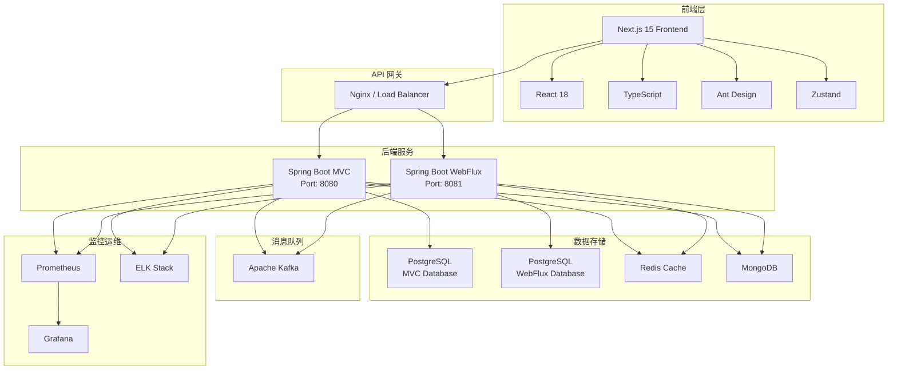

# 架构概览

## 项目简介

本项目是一个现代化的全栈应用框架，采用最新的技术栈构建，旨在提供高性能、可扩展、易维护的企业级应用解决方案。项目包含一个 Next.js 15 前端和两个不同架构的 Spring Boot 后端。

## 整体架构



## 技术栈对比

| 组件 | Next.js 前端 | Spring Boot MVC | Spring Boot WebFlux |
|------|-------------|----------------|-------------------|
| **运行时** | Node.js 18+ | JVM (Java 21) | JVM (Java 21) |
| **编程模型** | 同步/异步混合 | 同步阻塞 | 异步非阻塞 |
| **Web服务器** | Node.js | Tomcat (Servlet) | Netty (Reactive) |
| **数据访问** | HTTP Client | Spring Data JPA | Spring Data R2DBC |
| **数据库驱动** | - | JDBC | R2DBC |
| **并发模型** | 事件循环 | 线程池 | 事件驱动 |
| **适用场景** | SSR/CSR | 传统企业应用 | 高并发应用 |
| **端口** | 3000 | 8080 | 8081 |

## 架构优势

### 1. 多架构选择
- **MVC 架构**: 适合传统业务逻辑复杂的企业应用
- **WebFlux 架构**: 适合高并发、低延迟的互联网应用
- **灵活切换**: 可根据具体业务需求选择合适的架构

### 2. 现代化技术栈
- **前端**: Next.js 15 提供最新的 React 18 特性和性能优化
- **后端**: Spring Boot 3.3.5 支持 Java 21 的最新特性
- **类型安全**: TypeScript 全面覆盖，减少运行时错误

### 3. 高性能设计
- **前端**: 服务端渲染 (SSR) + 静态生成 (SSG)
- **MVC**: 成熟的连接池和缓存机制
- **WebFlux**: 响应式编程，支持更高的并发量

### 4. 开发体验
- **热重载**: 开发环境支持代码热更新
- **类型提示**: 全链路 TypeScript 支持
- **代码质量**: ESLint + Prettier + 单元测试

## 项目结构

```
murphy/
├── frontend/                 # Next.js 15 前端项目
│   ├── app/                  # App Router 路由
│   ├── components/           # React 组件
│   ├── lib/                  # 工具函数和状态管理
│   ├── public/               # 静态资源
│   └── package.json          # 前端依赖
│
├── backend-mvc/              # Spring Boot MVC 后端
│   ├── src/main/java/        # Java 源代码
│   ├── src/main/resources/   # 配置文件
│   ├── src/test/             # 测试代码
│   └── build.gradle          # 构建配置
│
├── backend-webflux/          # Spring Boot WebFlux 后端
│   ├── src/main/java/        # Java 源代码
│   ├── src/main/resources/   # 配置文件
│   ├── src/test/             # 测试代码
│   └── build.gradle          # 构建配置
│
├── doc/                      # 文档项目 (Docusaurus)
│   ├── docs/                 # 文档内容
│   ├── src/                  # 文档组件
│   └── package.json          # 文档依赖
│
├── docker-compose.yml        # 容器编排
├── package.json              # 根项目配置 (pnpm workspace)
└── README.md                 # 项目说明
```

## 开发环境

### 环境要求
- **Node.js**: 18.17.0+
- **Java**: OpenJDK 21+
- **pnpm**: 8.0.0+
- **Docker**: 20.10.0+
- **Docker Compose**: 2.0.0+

### 快速启动

#### 1. 安装依赖
```bash
# 安装前端依赖
pnpm install

# 安装文档依赖
cd doc && pnpm install && cd ..
```

#### 2. 启动基础设施
```bash
# 启动数据库、缓存、消息队列
docker-compose up -d postgres redis kafka
```

#### 3. 启动应用服务
```bash
# 启动前端 (端口 3000)
pnpm run dev:frontend

# 启动 MVC 后端 (端口 8080)
pnpm run dev:backend-mvc

# 启动 WebFlux 后端 (端口 8081)
pnpm run dev:backend-webflux

# 启动文档服务 (端口 3001)
pnpm run dev:doc
```

#### 4. 访问应用
- 前端应用: http://localhost:3000
- MVC API: http://localhost:8080/api
- WebFlux API: http://localhost:8081/api
- 文档站点: http://localhost:3001

## 部署方案

### 开发环境部署
```bash
# 使用 Docker Compose 一键部署
docker-compose up -d

# 访问各个服务
# Frontend: http://localhost:3000
# MVC Backend: http://localhost:8080
# WebFlux Backend: http://localhost:8081
# Docs: http://localhost:3001
```

### 生产环境部署
```yaml
# Kubernetes 部署示例
apiVersion: v1
kind: Namespace
metadata:
  name: murphy

---
apiVersion: apps/v1
kind: Deployment
metadata:
  name: frontend
  namespace: murphy
spec:
  replicas: 3
  selector:
    matchLabels:
      app: frontend
  template:
    metadata:
      labels:
        app: frontend
    spec:
      containers:
      - name: frontend
        image: murphy/frontend:latest
        ports:
        - containerPort: 3000

---
apiVersion: apps/v1
kind: Deployment
metadata:
  name: backend-mvc
  namespace: murphy
spec:
  replicas: 2
  selector:
    matchLabels:
      app: backend-mvc
  template:
    metadata:
      labels:
        app: backend-mvc
    spec:
      containers:
      - name: backend-mvc
        image: murphy/backend-mvc:latest
        ports:
        - containerPort: 8080
```

## API 设计规范

### RESTful API 约定
```
GET    /api/v1/users          # 获取用户列表
GET    /api/v1/users/{id}     # 获取单个用户
POST   /api/v1/users          # 创建用户
PUT    /api/v1/users/{id}     # 更新用户
DELETE /api/v1/users/{id}     # 删除用户
```

### 响应格式
```json
{
  "success": true,
  "data": {
    "id": 1,
    "name": "用户名",
    "email": "user@example.com"
  },
  "message": "操作成功",
  "timestamp": "2024-01-01T00:00:00Z"
}
```

### 错误处理
```json
{
  "success": false,
  "error": {
    "code": "USER_NOT_FOUND",
    "message": "用户不存在",
    "details": "User with id 123 was not found"
  },
  "timestamp": "2024-01-01T00:00:00Z"
}
```

## 数据库设计

### 数据库分离策略
- **MVC 数据库** (`yzt_mvc`): 传统关系型数据，事务性操作
- **WebFlux 数据库** (`yzt_webflux`): 高并发读写，实时数据
- **Redis 缓存**: 会话存储、频繁访问数据
- **MongoDB**: 日志数据、非结构化数据

### 用户表设计 (示例)
```sql
CREATE TABLE users (
    id BIGSERIAL PRIMARY KEY,
    email VARCHAR(255) UNIQUE NOT NULL,
    password VARCHAR(255) NOT NULL,
    name VARCHAR(100) NOT NULL,
    status VARCHAR(20) DEFAULT 'ACTIVE',
    created_at TIMESTAMP DEFAULT CURRENT_TIMESTAMP,
    updated_at TIMESTAMP DEFAULT CURRENT_TIMESTAMP
);

CREATE INDEX idx_users_email ON users(email);
CREATE INDEX idx_users_status ON users(status);
CREATE INDEX idx_users_created_at ON users(created_at);
```

## 监控和运维

### 应用监控
- **健康检查**: `/actuator/health`
- **指标收集**: Micrometer + Prometheus
- **链路追踪**: Spring Cloud Sleuth
- **日志聚合**: ELK Stack

### 性能指标
```yaml
# 关键性能指标 (KPI)
metrics:
  response_time: "< 100ms (p95)"
  throughput: "> 1000 req/s"
  availability: "> 99.9%"
  error_rate: "< 0.1%"
```

### 告警规则
```yaml
# Prometheus 告警规则
groups:
- name: murphy
  rules:
  - alert: HighResponseTime
    expr: http_request_duration_seconds{quantile="0.95"} > 0.1
    for: 5m
    
  - alert: HighErrorRate
    expr: rate(http_requests_total{status=~"5.."}[5m]) > 0.01
    for: 2m
```

## 安全考虑

### 认证授权
- **JWT Token**: 无状态认证
- **RBAC**: 基于角色的访问控制
- **CORS**: 跨域资源共享配置
- **HTTPS**: 生产环境强制加密

### 数据保护
- **密码加密**: BCrypt 哈希
- **敏感数据**: AES 加密存储
- **SQL 注入**: 参数化查询
- **XSS 防护**: 输入验证和输出转义

## 开发规范

### 代码规范
- **前端**: ESLint + Prettier
- **后端**: CheckStyle + SpotBugs
- **Git**: Conventional Commits
- **版本**: Semantic Versioning

### 分支策略
```
main           # 生产环境分支
develop        # 开发环境分支
feature/*      # 功能开发分支
hotfix/*       # 紧急修复分支
release/*      # 发布准备分支
```

### 代码审查
- **Pull Request**: 必须代码审查
- **自动化测试**: CI/CD 流水线
- **覆盖率要求**: 单元测试 > 80%
- **质量门禁**: SonarQube 质量检查

## 扩展路线图

### 短期目标 (1-3 月)
- [ ] 完善单元测试和集成测试
- [ ] 添加 API 文档 (OpenAPI/Swagger)
- [ ] 实现用户认证和权限管理
- [ ] 优化数据库查询性能

### 中期目标 (3-6 月)
- [ ] 微服务架构拆分
- [ ] 分布式配置中心
- [ ] 服务网格 (Istio)
- [ ] 多环境 CI/CD 流水线

### 长期目标 (6-12 月)
- [ ] 云原生架构改造
- [ ] 多租户 SaaS 支持
- [ ] 国际化和本地化
- [ ] 移动端应用支持

## 相关资源

### 官方文档
- [Next.js 文档](https://nextjs.org/docs)
- [Spring Boot 文档](https://spring.io/projects/spring-boot)
- [Spring WebFlux 文档](https://docs.spring.io/spring-framework/docs/current/reference/html/web-reactive.html)
- [React 文档](https://react.dev/)

### 社区资源
- [GitHub 仓库](https://github.com/murphy/architecture)
- [技术博客](https://blog.murphy.com)
- [技术交流群](https://t.me/murphy)
- [问题反馈](https://github.com/murphy/architecture/issues)

### 培训资料
- [前端开发指南](./frontend/introduction.md)
- [MVC 后端开发指南](./backend/mvc/introduction.md)
- [WebFlux 后端开发指南](./backend/webflux/introduction.md)
- [部署运维手册](./architecture/deployment.md)